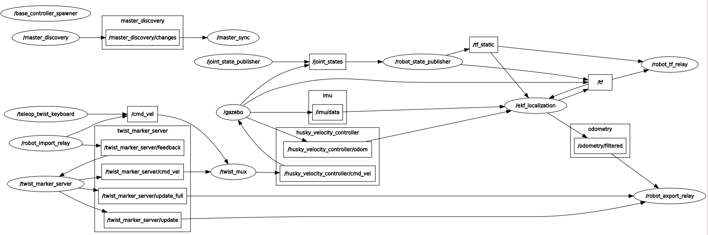

# Exbot ROS Rover  
版本Kinetic

by  
Chaozheng Zhu  
Top Liu  

软件：ROS+适用于四驱智能车  
车体：巨匠小路虎  
车载主控：树莓派Ubuntu mate 16.04 + Kinetic  
控制站PC： Ubuntu 16.04 + Kinetic  

Husky/husky-a200-unmanned-ground-vehicle-render.jpg)

## 安装
1. 树莓派（如果只是仿真可忽略此步骤）  
推荐安装Ubuntu mate 16.04 + Kinetic  
编译安装serial_server 

2. PC
运行安装脚本 
 
install_exbot_ros_rover_kinetic.sh  

## 仅在rviz观察
  
roslaunch husky_gazebo spawn_husky.launch  
roslaunch husky_viz view_model.launch  

## gazebo 仿真  

空地图，仅有无人车

roslaunch husky_gazebo husky_empty_world.launch  
第一次运行需要在线下载模型，需要等待几分钟方能正确显示  
运行rviz 
   
    roslaunch husky_viz view_model.launch
	
将左侧的FixedFrameodem从默认的base_link改为	
运行键盘控制
  
    rosrun teleop_twist_keyboard teleop_twist_keyboard.py
	
如果没有安装键盘控制包，则运行  

	sudo apt-get install ros-kinetic-teleop-twist-keyboard  
	

加载指定地图
	
roslaunch husky_gazebo husky_empty_world.launch world_name:=worlds/willowgarage.world	

	
# 运行实体机器人	
## Rover配置 
首先配置网络  
1. PC  
如果PC使用的是虚拟机，需要将Nat模式改为桥接模式（不要选择下面的复制IP）  
查看PC的ip  
ifconfig     
2. 连接树莓派到本地的局域网  
将树莓派通过HDMI线连接到电脑屏幕， 通过鼠标选择当前的网络， 进行连接。  
进入路由器找到当前的无线网中， 树莓派所属的IP地址  
ifconfig   
配置下hosts文件， 便于实现分布式通信  
vi /ect/hosts  
添加下面一行  
(ubuntu主机的ip) （Ubuntu主机的名字）   
例如  
192.168.1.102 blackant-desktop  
3. 配置PC的hosts  
配置下hosts文件， 便于实现分布式通信  
vi /ect/hosts  
添加下面一行  
(树莓派的ip) （树莓派的主机名字）  
例如  
192.168.1.101 Raspberry  

## 控制
### 启动树莓派中的串口server程序
首先我们先给USB串口一个权限  
sudo chmod 777 /dev/ttyUSB0  
roscore & 
最好是到目录下启动serial_server  
cd ~/catkin_ws/devel/lib/serial_server  
./serial_server  

### PC
1. 配置PC的ROS_MASTER_URI  
export ROS_MASTER_URI=http://（树莓派的主机名字）:11311  
2.运行rviz  
roslaunch rover_rviz.launch  
3. 控制Rover跑起来  
rosrun nav_test control.py  
上下左右键控制运动  
空格 停车  

